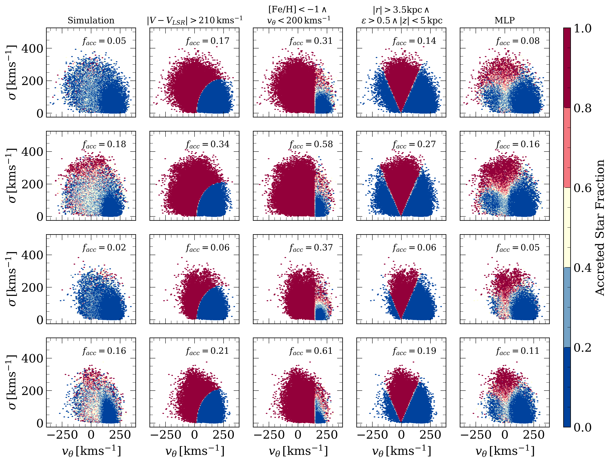

This repository contains the codes and machine learning models developed for separating accreted and in-situ stars in Milky Way-like galaxies.
These are defined as disc galaxies (corotational parameter *&epsilon;* > 0.5) within a dark matter halo of mass *M*<sub>200</sub> ~ 10<sup>12</sup> M<sub>&#9737;</sub>. 

The available models are:

- multilayer perceptron (**MLP**);

- **MLP with galaxy features**;

- transformational machine learning (**TML**), based on an ensemble of MLPs;

- **XGBoost**.
  
All models can be found in the implementations developed using both ARTEMIS and Auriga data.  

The codes for the training and optimisation of the models are reported in [codes](./codes/) for reference. 


# Main Advantages

Compared to traditional selection criteria, machine learning models provide:

1. more realistic description of the distribution of accreted stars in the galaxy;

2. higher purity in the retrieved sample of accreted stars;

3. adjustable classification threshold, which allows the user to decide whether to focus on the purity or completeness of the accreted stars sample. 



The performance of the models might vary depending on the data they are applied on. The MLP developed on ARTEMIS data is shown to be the most robust in terms of performance.

# Dependencies

The following list of **packages** is required to use the models:

- **joblib**                       (recommended version: 1.2.0)

- **numpy**                        (reccommended version: 1.24.3)

- **tensorflow**                   (recommended version:  2.13.0)


# Get Started


1. Clone this repository

```
git clone https://github.com/ariasant/ML-accreted-vs-insitu.git
```

2. OPTIONAL: Add the path of the repository to your python path

Ex: for MAC and Linux distributions add this in you .bashrc file:

```
export PYTHONPATH="${PYTHONPATH}:/path/to/this/repository"
```

3. Create a virtual environment with all the dependencies

Ex: using conda:

```
conda create -n foo python=3.9.16 joblib=1.2.0 numpy=1.24.3 tensorflow=2.13.0
```

4. Activate the environment

Ex: using conda:

```
conda activate path/to/environemnt/foo
```

5. Import the model you want to use

Inside your favourite Python development environment:

```
from models import MLP_ARTEMIS

model = MLP_ARTEMIS()

```

6. Load data

Define your array of input data making sure to follow the indications in the documentation.

7. Get predictions

```
predictions = model.predict(previously_loaded_data,
                            threshold=0.5
)
```

# Documentation


The machine learning models have been trained using specific vectors of stellar properties for the star particles in the ARTEMIS and Auriga simulations. When the models are applied to new data, it is crucial to provide them in the order and units specified in the documentation of each model.  

| Feature                        | Description                                                                  | Units                |
| ------------------------------ | -------------------------------------------------------                      | -----                |
||<p style="text-align: center;">Stellar Properties </p>||
| *R*                            | Galactocentric radius in the plane of the disc.                              |  kpc                 |
| *z*                            | Distance from the plane of the disc.                                         |  kpc                 |
| *v<sub>&theta;</sub>*          | Velocity in the direction of disc rotation.                                  |  kms<sup>-1<sup>     |
| *&sigma;*                      | Dispersion velocity in the plane perpendicular to the disc.                  |  kms<sup>-1<sup>     |
| [Fe/H]                         | Iron-to-hydrogen abundance.                                                  |         -            |
| [*&alpha;*/Fe]                 | *&alpha;*-to-iron abundance.                                                 |         -            |
| M<sub>G</sub>                  | Absolute magnitude in the Gaia M<sub>G</sub>  passband.                      |         -            |
| BP-RP                          | Colour evaluated in the Gaia G<sub>BP</sub> and G<sub>RP</sub> passbands.    |         -            |
||<p style="text-align: center;">Galaxy Properties </p>||
| *&kappa;*<sub>co</sub>         | Co-rotational parameter.                                                     |         -            |
| *M*<sub>*</sub>               | Total stellar mass within 30 kpc radius.                                     |   10<sup>10</sup> M<sub>&#9737;</sub>|
| *r<sub>1/2</sub>*                | Half-radius.                                                                 |   kpc                |
| *v<sub>&theta; MAX</sub>*          | Maximum rotational velocity within 30 kpc radius.                            |   kms<sup>-1<sup>    |
| &#9001;[Fe/H]&#9002;           | Average iron-to-idrogen abundance.                                           |        -             |
| &#9001;[*&alpha;*/H]&#9002;           | Average *&alpha;*-to-idrogen abundance.                                           |        -             |

### MLP_ARTEMIS, MLP_Auriga

These are subclasses of `tensorflow.keras.Model` objects. The models have been trained on stellar properties only. Method:

### predict

```
.predict(x,
         threshold=None
         )
```

| Args | |
| - | - |
| <p style="text-align: center;">*x* </p>| <p> Numpy array of *N* stars with shape (*N*,8) </p> <p> Order: <b> *R*, *z*, *v<sub>&theta;</sub>*, *&sigma;*, [Fe/H], [*&alpha;*/Fe], M<sub>G</sub>, BP-RP </b> </p> |
| threshold | <p> "**None**" or float between 0 and 1. The classification threshold used for separating accreted and in-situ stars. </p>  |
| | |
| **Returns** | <p> Numpy array of class predictions: 0 -> In-situ, 1-> Accreted. </p> <p> If `threshold=None`, the probabilities of stars belonging to the accreted class are returned. </p> |


## MLP_galaxy_features_ARTEMIS, MLP_galaxy_features_Auriga

These are subclasses of `tensorflow.keras.Model` objects. The models have been trained on stellar properties and on general properties of the associated galaxies. Method:

### predict

```
.predict(x,
         threshold=None
         )
```

| Args | |
| - | - |
| <p style="text-align: center;">*x* </p>| <p> Numpy array of *N* stars with shape (*N*,8) </p> <p> Order: <b> *R*, *z*, *v<sub>&theta;</sub>*, *&sigma;*, [Fe/H], [*&alpha;*/Fe], M<sub>G</sub>, BP-RP, *M*<sub>star</sub>, *r*<sub>1/2</sub>, *v*<sub>&theta;MAX</sub>, &#9001;[Fe/H]&#9002;, &#9001;[*&alpha;*/H]&#9002;</b>  </p>  |
| threshold | <p> "**None**" or float between 0 and 1. The classification threshold used for separating accreted and in-situ stars. </p>  |
| | |
| **Returns** | <p> Numpy array of class predictions: 0 -> In-situ, 1-> Accreted. </p> <p> If `threshold=None`, the probabilities of stars belonging to the accreted class are returned. </p> |

## TML_ARTEMIS, TML_Auriga

These are subclasses of `tensorflow.keras.Model` objects. The models are based on an ensemble of MLPs, each of which is `tensorflow.keras.Model` object. During the prediction, *x* is passed to each MLP in the ensemble. The resulting ensemble of predictions is then used as an input to another MLP. Method:
```
.predict(x,
         threshold=None
         )
```

| Args | |
| - | - |
| <p style="text-align: center;">*x* </p>| <p> Numpy array of *N* stars with shape (*N*,8) </p> <p> Order: <b> *R*, *z*, *v<sub>&theta;</sub>*, *&sigma;*, [Fe/H], [*&alpha;*/Fe], M<sub>G</sub>, BP-RP </b> </p> |
| threshold | <p> "**None**" or float between 0 and 1. The classification threshold used for separating accreted and in-situ stars. </p>  |
| | |
| **Returns** | <p> Numpy array of class predictions: 0 -> In-situ, 1-> Accreted. </p> <p> If `threshold=None`, the probabilities of stars belonging to the accreted class are returned. </p> |

## xgb_ARTEMIS, xgb_Auriga

These are trained instances of the `xgboost.XGBClassifier` object. Method:

```
.predict(x,
         threshold=None
         )
```

| Args | |
| - | - |
| <p style="text-align: center;">*x* </p>| <p> Numpy array of *N* stars with shape (*N*,8) </p> <p> Order: <b> *R*, *z*, *v<sub>&theta;</sub>*, *&sigma;*, [Fe/H], [*&alpha;*/Fe], M<sub>G</sub>, BP-RP </b> </p> |
| threshold | <p> "**None**" or float between 0 and 1. The classification threshold used for separating accreted and in-situ stars. </p>  |
| | |
| **Returns** | <p> Numpy array of class predictions: 0 -> In-situ, 1-> Accreted. </p> <p> If `threshold=None`, the probabilities of stars belonging to the accreted class are returned. </p> |


# Reference Paper 
